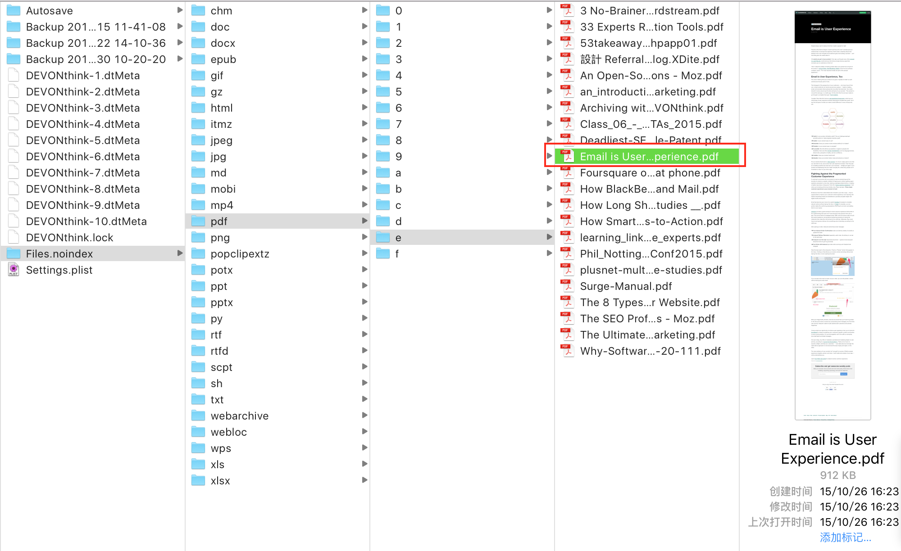
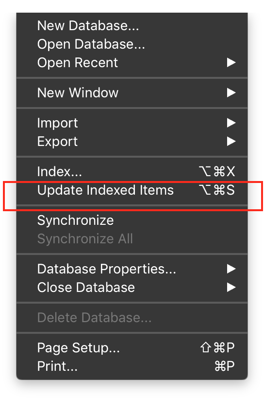

#DEVONthink使用教程

Author: [crystone](https://twitter.com/crystone)

Date: 2015/10/30

## 1. 存储格式

DEVONthink管理文件有两种方式，index索引方式，import导入方式。下面介绍一下这两种方式如何使用以及如何选择怎样的方式最好。

### 1.1 索引index方式

索引方式类似于Windows下的快捷方式，或者Linux/Mac下的软链接方式，只是一个指向真实文件地址的一个指针而已。所以索引文件方式有几个特点：

* 占用空间小
* 将索引文件删除后，原文件不受影响
* 文件的保存地址和DEVONthink是独立分开的，只要文件保存位置不便，数据库都能索引到
* 索引有个很方便的功能，可以将文件夹整体索引进数据库中，并保持原来目录结构不变
* 索引进数据库的文档和文件夹，在右上角有一个指向右上角的箭头，这样方便和一般的导入文件分别开来

将文件索引进DEVONthink数据库中：

### 1.2 导入import方式

导入方式是在DEVONthink数据库中存放一份原始文件的拷贝，所以在导入的文件有如下特点：

* 占用空间比索引大。其实在文件导入DEVONthink数据库后，原始文件就可以删除了，这样文件就存在数据库中了，在大小上和索引方式几乎一样。
* 占用数据库空间。

有几种方式将文件导入数据库中：

* 将文件拖到屏幕边缘的小抽屉（Sorter）上，抽屉自动打开，鼠标在要保存的文件夹或Inbox上松开，文件就导入到DEVONthink了。
* 将文件拖动到DEVONthink窗口的相应数据库的相应文件夹下面。并且也可以保持原始文件夹目录结构不变。
* 通过菜单，可以将多种格式的数据导入到DEVONthink中

图中可以看出，DEVONthink支持导入多种的文件格式。

### 1.3 两种方式对比

从上面的分析可以看出，DEVONthink在管理这两种方式的文件内部的组织是不一样的。但我们只需要知道这些就足够了，对于我们后面要做的分组，标签，归档，查找的使用上并没有不同。

一般文件都是导入方式进入数据库的，但如果在想保持文件独立于数据库，或者文件很多并且已经分类好，可以选择索引方式。

另外值得提的一点是，数据库中索引文件可以随意组织：放入不同组、改名、添加tag信息、将索引文件删除，对原文件没有任何影响。这也是选择索引方式的一个好处。

### 1.4 DT内部存储格式

下面是导入的文件在DEVONthink内部数据库的存储：（可以点击文件 → 右键 → Show in Finder查看）

索引方式只是一个链结指向原文件。Show in Finder打开的是原文件所在的文件夹。

如果索引指向的文件发生了变化，DEVONthink是不会自动更新的，需要你手动进行更新索引：

下一章讲解如何新建数据库，如何导入/索引各种数据，数据库加密，以及到底选择单数据库还是多个数据库。

