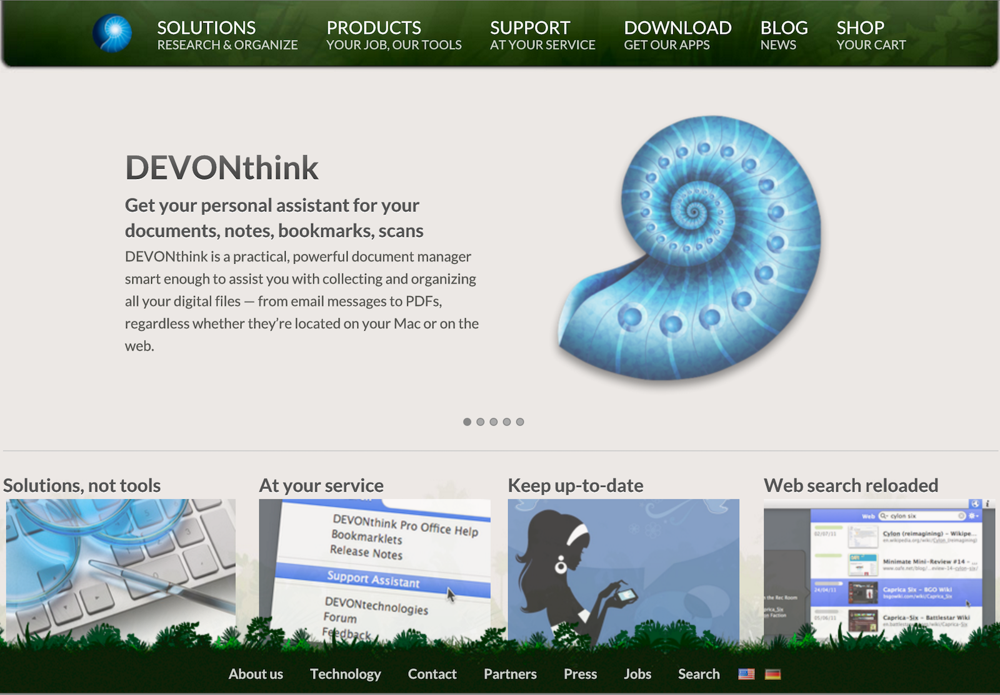
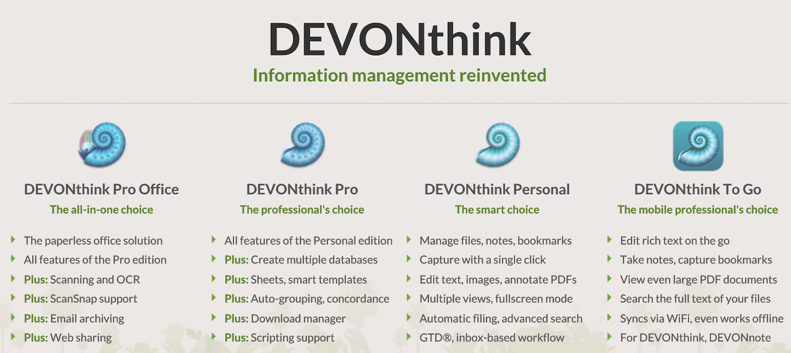

#Devonthink使用教程

Author: [crystone](https://twitter.com/crystone)

Date: 2015/10/23

## 0. Devonthink简介

### 0.1 Devonthink是什么

以下是官方介绍软件的功用。

Devonthink不仅只是用来存储文档而已，它还可以做到集编辑、分析、组织、查找、存档于一身。作为一个集成的工作环境，大大优化和加强了Finder，节省了在成千上万的文件当中处理的时间。

文档同步方式也有多种选择：不仅可以将你的多台Mac电脑直接连接起来同步，而且还有Dropbox, WebDav，移动硬盘等多种同步方式。

Devonthink不仅仅是一个文档数据库，而且也是收集组织处理文档的首选工具。

因此，完全学回并利用好Devonthink所提供的众多功能并不是一件容易的事情。笔者也是在使用软件当中一边学习，一边总结纪录，以求更好的提升工作效率。其中也许有很多地方有遗漏和错谬的地方，欢迎读者随时指正。

### 0.2 Devonthink能干什么

基本上你能想到关于数字文档的存储、编辑处理、搜索、归档等需求，Devonthink都能做到。

存储：它能支持的文档格式也是众多：网页，书签，txt文本文档，RTF富文本文档，doc/ppt/xls文档，PDF文档，mp3音频，jpg/png图片，mp4/avi/mpg视频，可以说工作和日常常用的文件格式都支持。可以根据需求选择导入或者索引方式处理文件，具体该选择索引还是导入方式后文有详细讲解说明。

### 0.3 哪里能买到？

那么，哪里能买到呢？

官网购买地址是[http://www.devontechnologies.com/download/products.html](http://www.devontechnologies.com/download/products.html)，有两个版本，一个是官网下载版，一个是Mac App Store版，具体选择买哪个，看你的喜好而定了。

最近[http://www.macupdate.com](http://www.macupdate.com)上活动价格非常不错，建议选择离线安装版的在这里购买。

	TIPS：

最近这几天在http://www.macupdate.com 网站上购买还不是最优惠的价格，推荐安装MacUpdate Destop这个app，从MacUpdate Destop进去购买只需要$15，不到官网价格的19%。当然你需要双币信用卡，或者有一个paypay帐号。不保证此优惠随时有效，所以需要的不要犹豫赶紧下单，肯定不会后悔。

### 0.4 选择哪个版本好？

DEVONthink版本众多，到底买哪个版本好呢？(壕直接买最贵的就好了，没错的)

有手机版DEVONthink To Go，有个人版DEVONthink Personal，有专业版DEVONthink Pro，有威力增强版DEVONthink Pro Office。

下面贴一张官网的功能对比图，Pro Office比Pro版多了扫描OCR和归档电子邮件功能。如果痛点是需要这几个功能可以选择Pro Office。

刚好上面提到的MacUpdate Desktop优惠价$15提供的是Pro版，对于我们一般使用功能完全足够了。下面提到的各种使用都是基于这个版本的，Pro Office也是类似，Personal版在已有的功能上使用也应该是一样的，这里就不区分版本了。iOS 手机版to go使用是完全不一样，此文不作介绍。

